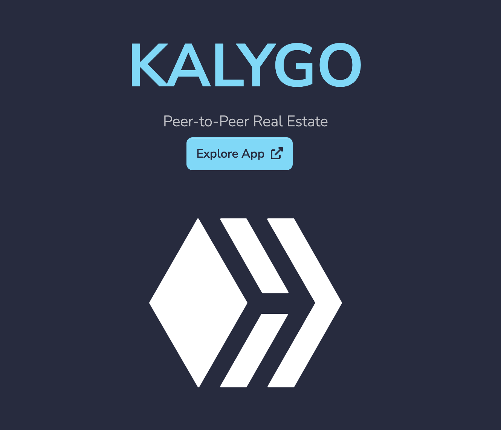

LIVE SITE: https://kalygo.io

# Kalygo.io
This is the front end for the kalygo.io website. The vision is to add more high quality blockchain contracts to the platform in a Blockchain agnostic manner.

The website has 2 functional contracts:

1) Tokenized Asset

2) Cash purchasd

implemented with a fungible ASA

contract code here: https://github.com/thaddavis/kalygo_contracts

## Additional technical information
This project was bootstrapped with [Create React App](https://github.com/facebook/create-react-app).

## Available Scripts
`npm start`

`npm test`

`npm run build`

`npm run eject`

`npm run deploy`
